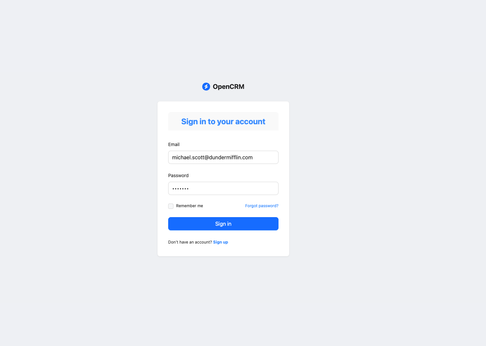
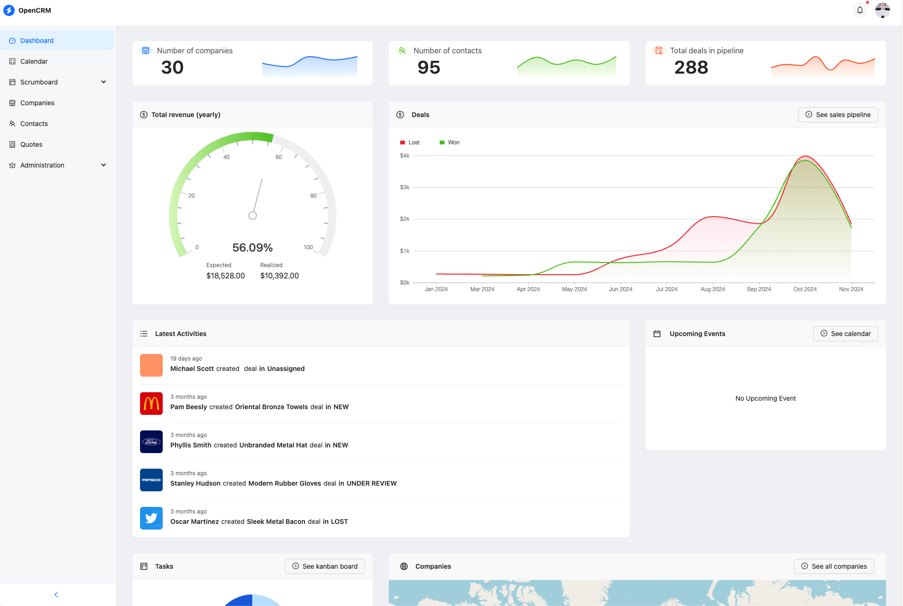
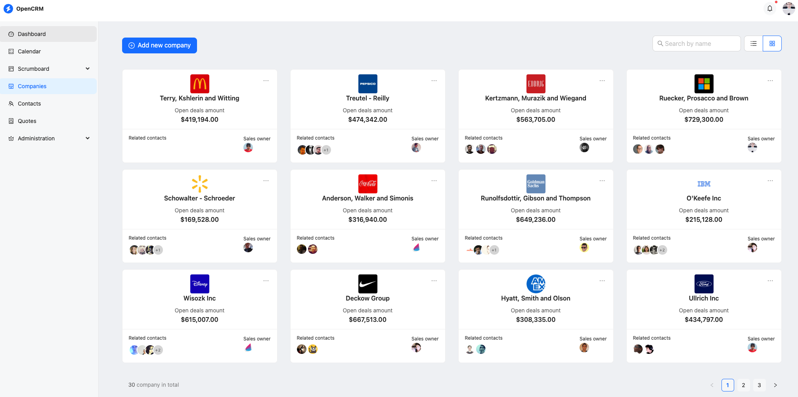
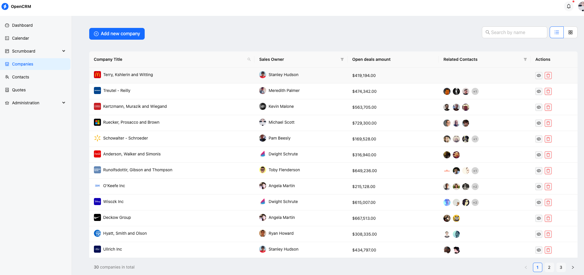

> 🚨 This project is for learning purposes only and it is not recommended to deploy it directly to a production environment.

<br />

<table>
  <tr>
    <td style="width: 50%;"></td>
    <td style="width: 50%;"></td>
    </tr>
    <tr>
    <td style="width: 50%;"></td>
    <td style="width: 50%;"></td>
  </tr>
</table>

<br />

<div align="center">This is a complete CRM (Customer Relationship Management) example project. It provides a set of tools and features to manage customer data, track interactions, and streamline business processes</div>

<br />
<br />

# About

This project is inspired by [Refine CRM(Customer Relationship Management) Example](https://github.com/refinedev/refine/tree/main/examples/app-crm), which is built using [refine](https://refine.dev/) and [Ant Design](https://ant.design/)

It implement a [GraphQL API](http://graphql.org/) based on [Spring for GraphQL](https://github.com/spring-projects/spring-graphql) and provides an example of API for the FrontEnd.

## Features

Some features that are built in:

- The application includes features such as dashboard analytics, a calendar for scheduling appointments, a scrum board for task management, and CRUD operations for managing companies, contacts, and quotes.
- Security: The `/graphql` Http and Websocket endpoint are secured and can only be accessed using a JWT token. More fine grained security is implemented by `@PreAuthorize` annotations on the methods.
- Tests: See `test` folder for typical GraphQL endpoint tests, including tests for security.
- End-to-end browser tests: See `e2e-tests` folder for folder for some [Playwright](https://playwright.dev/) based end-to-end tests that test the running application in a real browser.
- Github action workflow:
  - builds and tests the backend.
  - starts the backend including the database with docker-compose to run the end-to-end tests.
  - (see `.github/workflows/build-app.yml`)

## Running the application

You can run the application with two ways:

1. The easiest way: run it pre-configured in cloud IDE [GitPod](https://www.gitpod.io/)
2. Run it locally

### Run it in Gitpod

TBC

### Running locally

The server is implemented in the `backend` folder and can be started either from your IDE (`com.opencrm.app.Application`) or using gradle from the `backend` folder of the repository:

```bash
# Navigate to backend folder
cd backend

# Build the project
./gradlew build

# Run the application
./gradlew bootRun

# The server will start on http://localhost:8080
```

For Windows users, use `gradlew.bat` instead of `./gradlew`.

Note: the server runs on port **8080**, so make sure, this port is available

- You need to have docker installed. `docker-compose` needs to be in your path.
- On startup the server use [Spring Boot docker compose support](https://docs.spring.io/spring-boot/docs/current/reference/htmlsingle/#features.docker-compose) to support the required postgres database.

### Running the frontend

You can install and start the frontend by using [pnpm](https://pnpm.io):

```bash
# Navigate to frontend folder
cd ./frontend

# Install all the dependencies
pnpm install

# Generate the graphql code, including types, queries and mutations
pnpm codegen

# Start the server in development mode
pnpm dev

# The running frontend can be accessed on [http://localhost:4000](http://localhost:4000)
```
